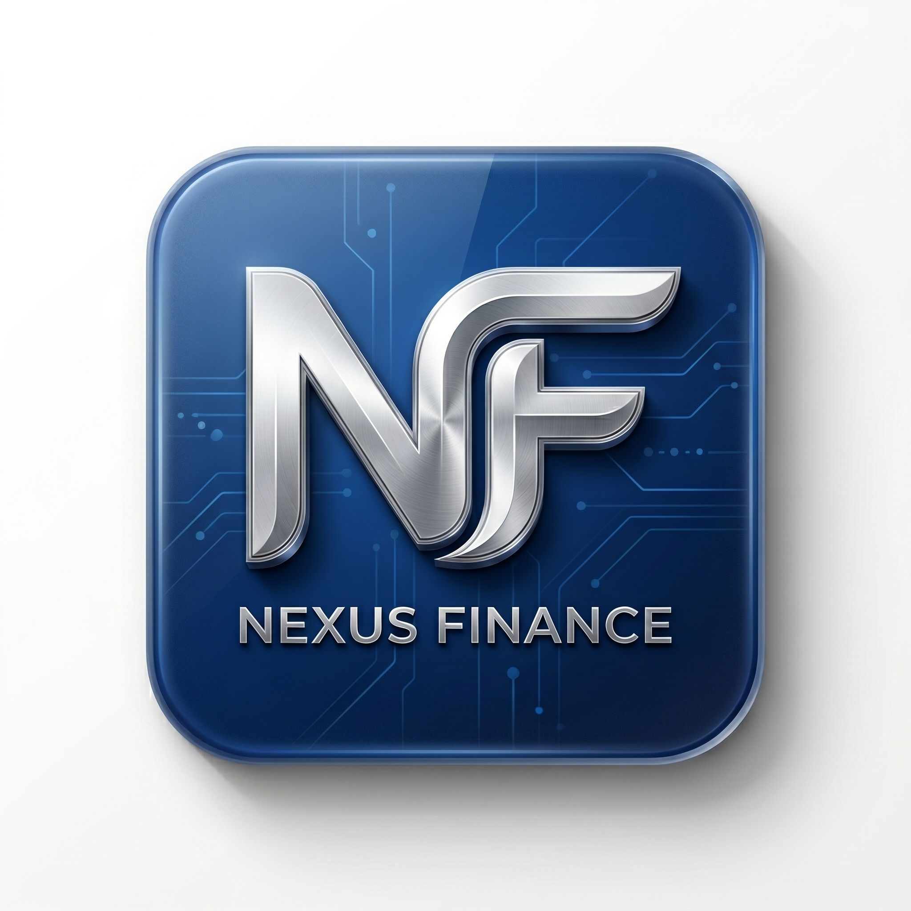

# 🚀 Nexus Finance v3.0
### **Modern SaaS Cash Flow Management Engine**

<p align="center">
  
</p>

<p align="center">
  
  
  
  
  
  
</p>

---

## 👨‍💻 Developed by **Idin Iskandar, S.Kom**
> **"Membangun solusi kompleks melalui keterbatasan perangkat untuk membuktikan kekuatan logika."**

**Nexus Finance** adalah manifestasi dari arsitektur *Serverless modern* yang dikerjakan sepenuhnya (**100%**) melalui lingkungan **Termux Android**. Menggabungkan ekosistem Google (Sheets & Drive) dengan framework React untuk menciptakan aplikasi pengelolaan keuangan yang *secure*, *multi-user*, dan *high-performance*.

---

## 🛠️ Key Features

- 🔐 **Secure Multi-User Auth** — Sistem login, registrasi, dan proteksi data antar pengguna yang terisolasi.
- 📧 **Automated OTP System** — Verifikasi pendaftaran otomatis melalui Gmail API (Google Apps Script).
- 📊 **Dynamic Analytics Dashboard** — Visualisasi arus kas masuk dan keluar secara real-time dengan **Recharts**.
- 📁 **Cloud Drive Integration** — Sistem upload foto profil user langsung ke Google Drive via Base64 Proxy.
- 📄 **Professional Reporting** — Export riwayat transaksi ke format **PDF** dan **CSV** dengan satu klik.
- 🌓 **Adaptive UI/UX** — Support penuh Dark Mode & Light Mode dengan desain ultra-minimalist.
- 📱 **Mobile-First Responsive** — Antarmuka yang dioptimasi untuk penggunaan smartphone.

---

## 🏗️ Technical Architecture

| Layer | Technology |
|---|---|
| **Frontend** | React JS (Vite) + Tailwind CSS + Shadcn UI |
| **State Management** | React Query (TanStack Query) |
| **Backend Engine** | Google Apps Script (Web App API) |
| **Database** | Google Sheets (Relational Database Concept) |
| **Storage** | Google Drive API (Image Hosting) |
| **Deployment** | Vercel (Frontend) |

---

## 🚀 Get Started

### 1. Backend Setup (GAS)
1. Salin kode dari file `backend/skrip.gs` ke **Google Apps Script** Anda.
2. Siapkan **Google Sheets** dan ambil ID-nya untuk variabel `ssId`.
3. Siapkan Folder **Google Drive** (set Public), ambil ID-nya untuk variabel `folderId`.
4. Jalankan fungsi `triggerAuth` untuk mengaktifkan izin Drive & Gmail.
5. Deploy sebagai **Web App** dan pastikan akses disetel ke `Anyone`.

### 2. Frontend Installation
```bash
# Clone the repository
git clone https://github.com/idiniskandar/nexus-finance.git

# Enter the directory
cd nexus-finance

# Install dependencies
npm install --legacy-peer-deps

# Configure API URL
# Edit src/lib/finance-api.ts and paste your GAS Web App URL

# Run Development
npm run dev -- --host
